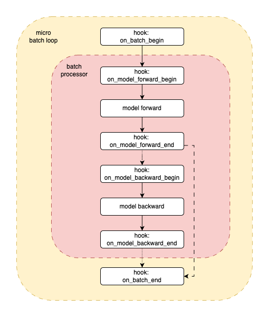

.. _overview_hook_based_trainer_arch:

Hook Based Trainer Architecture
==========================================

The :py:class:`~robo_orchard_lab.pipeline.hook_based_trainer.HookBasedTrainer` is the heart of RoboOrchardLab,
orchestrating the training and evaluation processes through a structured and extensible pipeline.
This pipeline is characterized by nested execution loops and numerous hook channels, allowing for precise customization at various stages.

Visualizing the Execution Flow
------------------------------

To effectively leverage the hook system, it's crucial to understand
the pipeline's execution flow. The following diagrams illustrate this structure,
starting with a high-level view of the nested loops and then detailing the operations
within a single micro-batch.

1. Nested Execution Loops
^^^^^^^^^^^^^^^^^^^^^^^^^^^^^^^

The core pipeline operates as a series of clearly defined, nested loops, each associated with specific hook channels:

.. figure:: ../_static/overview/hook_based_trainer_arch.png
   :alt: Nested Loop Structure
   :align: center
   :width: 100%

   High-level view of the nested execution loops: Main Loop, Epoch Loop, Step Loop, and Micro Batch Loop with the Batch Processor at its core.

* **Main Loop (on_loop_* hooks)**: This is the outermost context,
  encompassing the entire run (e.g., a full training session or an evaluation pass).
  ``on_loop_begin`` is for global setup, and ``on_loop_end`` is for final cleanup and reporting.
* **Epoch Loop (on_epoch_* hooks)**: Iterates over the specified number of epochs.
  ``on_epoch_begin`` allows for epoch-specific initializations (e.g., resetting metrics),
  while ``on_epoch_end`` is typically used for validation, learning rate adjustments,
  and epoch-level checkpointing/logging.
* **Step Loop (on_step_* hooks)**: Represents one optimizer step. If gradient accumulation is used,
  this loop will encompass the processing of multiple micro-batches before model weights are updated.
  ``on_step_begin`` precedes micro-batch processing for the current optimizer step, and ``on_step_end`` follows the (potential) optimizer update.
* **Micro Batch Loop (on_batch_* hooks)**: This is the innermost data processing loop,
  handling one micro-batch at a time as provided by the DataLoader. The **Batch Processor** component executes its core logic within this loop.

2. Detailed Micro Batch Processing and Hook Activation
^^^^^^^^^^^^^^^^^^^^^^^^^^^^^^^^^^^^^^^^^^^^^^^^^^^^^^^^^^^^^^

The diagram below details the operations and hook activations *within* a single iteration of the "Micro Batch Loop," as orchestrated by the **Batch Processor**:

   Detailed flow for processing a single micro-batch, highlighting model execution stages and their corresponding hook points.

This detailed flow for a micro-batch proceeds as follows:

* **hook: on_batch_begin**: Triggered before any processing of the current micro-batch.
* **hook: on_model_forward_begin**: Called immediately before the model's forward pass.
* **model forward**: The Batch Processor executes the model's forward pass using the current micro-batch, typically computing outputs and loss.
* **hook: on_model_forward_end**: Called immediately after the forward pass. Model outputs and loss are usually available in ``PipelineHookArgs`` at this point, making it suitable for metric updates.
* *(Conditional Backward Pass - see "Training and Evaluation Modes" below)*
* **hook: on_model_backward_begin**: Called just before initiating the backward pass (gradient computation).
* **model backward**: The Batch Processor executes the backward pass (e.g., ``accelerator.backward(loss)``).
* **hook: on_model_backward_end**: Called immediately after the backward pass. Gradients are now available.
* **hook: on_batch_end**: Triggered after all operations for the current micro-batch (including forward and potential backward passes) are complete.

Core Operations
------------------------------------
The **Batch Processor** is responsible for the ``model forward`` and ``model backward`` stages. The ``HookBasedTrainer``,
in conjunction with **Hugging Face ``Accelerator``**, manages higher-level operations such as:

* Moving data and models to the correct device.
* Wrapping the model, optimizer, and dataloader for distributed training.
* Handling gradient accumulation (the step loop iterates over micro-batches, and ``Accelerator`` determines when to sync gradients and step the optimizer).
* Performing ``optimizer.step()`` and ``optimizer.zero_grad()``, typically aligned with the ``on_step_end`` hook context.
* Calling ``lr_scheduler.step()``, often within ``on_step_end`` or ``on_epoch_end`` depending on the scheduler type.

Role of ``PipelineHookArgs``
--------------------------------------------------------
At every hook trigger point (i.e., within the ``on_enter`` and ``on_exit`` methods of a ``HookContext`` registered to a channel),
an instance of ``PipelineHookArgs`` is passed. This object provides rich contextual information about the current state of the pipeline,
including epoch/step IDs, the current micro-batch data, model outputs, computed loss, and references to the ``accelerator``, ``optimizer``, etc.
This allows hooks to make informed decisions and perform relevant actions.

Training and Evaluation Modes
----------------------------------------------------------
The pipeline structure illustrated is versatile:

* **Training Mode**: The ``model backward`` operation and its associated hooks (``on_model_backward_begin``, ``on_model_backward_end``) are executed. The ``BatchProcessor`` is typically configured with ``need_backward=True``.
* **Evaluation Mode**: The ``model backward`` operation and its hooks are skipped. This is achieved by configuring the ``BatchProcessor`` appropriately (e.g., ``need_backward=False``) or by the trainer using a different execution path for evaluation steps.
  The ``on_batch_end`` hook remains crucial for calculating evaluation metrics. An evaluation phase is often triggered via the ``on_epoch_end`` hook.

Extensibility through Hooks
------------------------------------------------------
This detailed, hook-rich pipeline architecture provides numerous well-defined points for injecting custom logic.
Users can develop and register hooks to implement a wide array of functionalities—such as custom metric logging,
advanced checkpointing strategies, dynamic parameter adjustments, early stopping, and interaction with external
systems—without needing to modify the core ``HookBasedTrainer`` or ``BatchProcessor`` code.
This makes RoboOrchardLab highly adaptable and powerful for diverse research and development needs in embodied AI.
